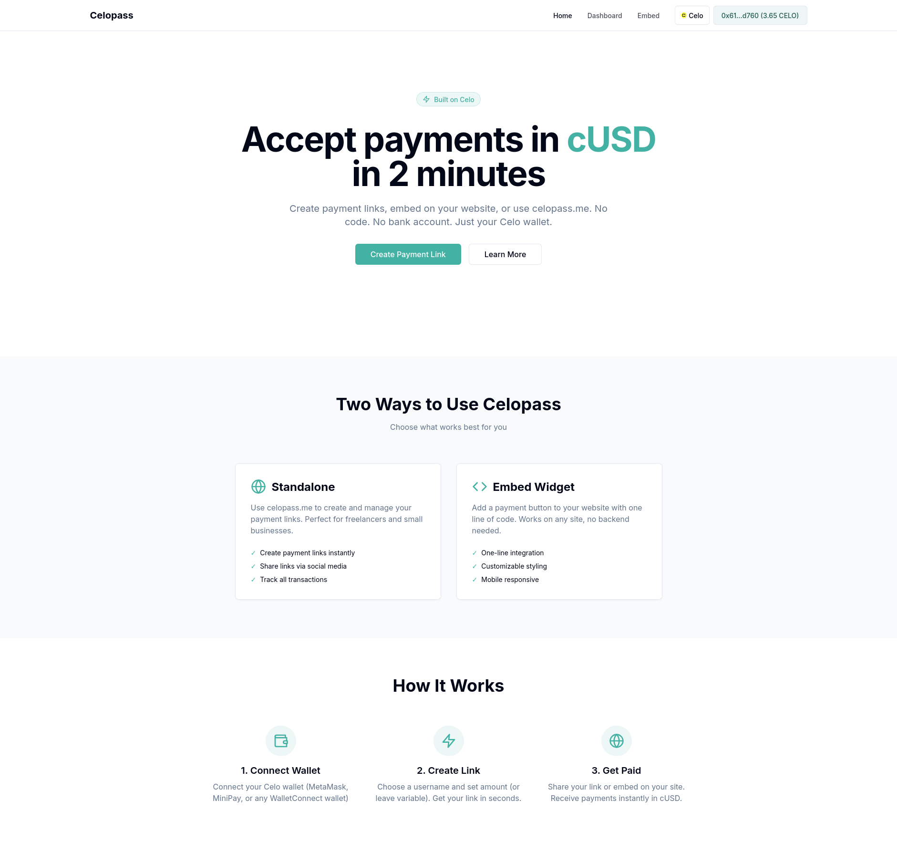
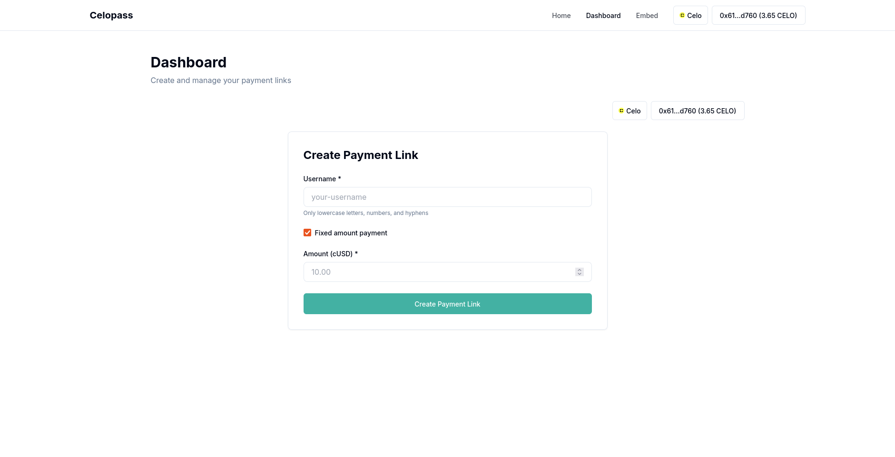
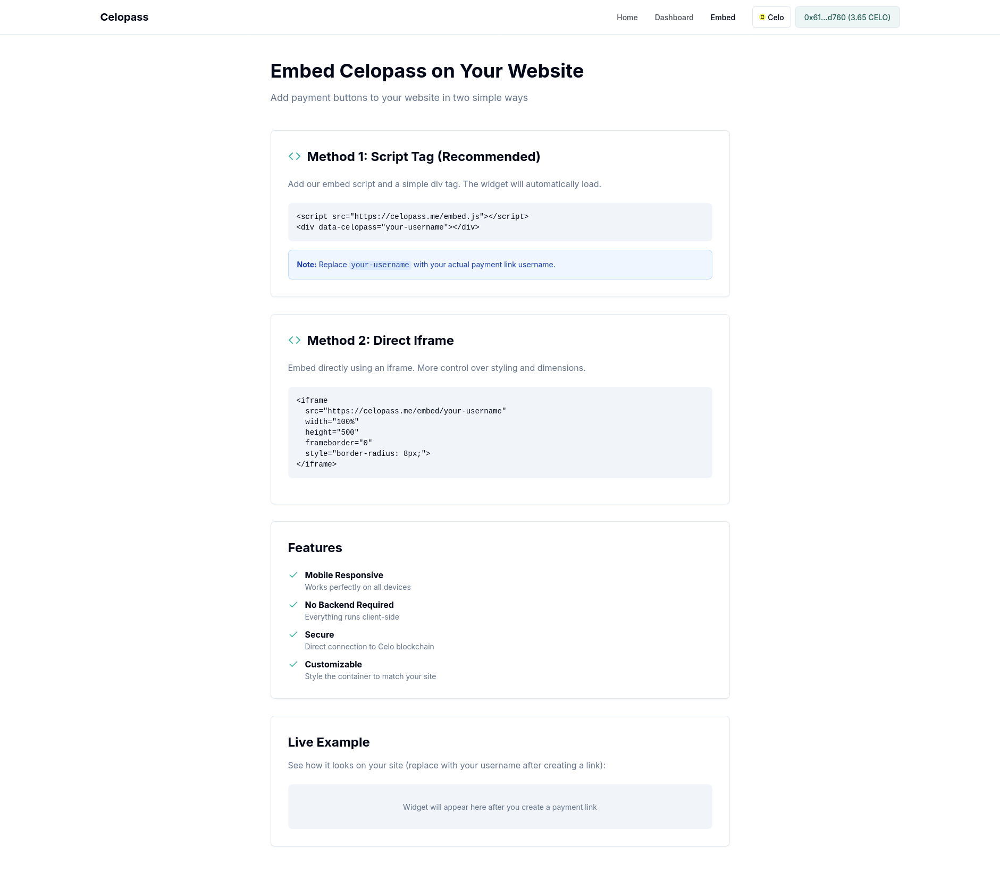

# 🔐 Celopass

**Your Identity and Payment Pass on Celo | Proof-of-Ship #10 Submission**

## 🎯 Project Mission

Democratize global payments and digital identity on Celo. Enable anyone—freelancers, small businesses, creators—to generate no-code payment links and accept cUSD in under 2 minutes, without banks or technical knowledge.

**Vision:** Make Celo the default payment and identity infrastructure for the next billion unbanked users.

---

## 📸 Screenshots

<div align="center">

### Main Page


### Dashboard


### Embed Widget


</div>

---

## 🚀 Quick Start

### Prerequisites

- Node.js v18+
- pnpm v8+ (or npm/yarn)
- A Celo wallet with testnet funds (for deployment)

### Installation

```bash
# Install dependencies
pnpm install

# Start development server
pnpm dev
```

### Environment Setup

1. **Frontend (.env.local in apps/web/)**
   ```bash
   NEXT_PUBLIC_WALLET_CONNECT_PROJECT_ID=your_walletconnect_project_id
   NEXT_PUBLIC_PAYMENT_ROUTER_ADDRESS=0x... # Fill after deployment
   ```
   Get WalletConnect Project ID from: https://cloud.walletconnect.com/

2. **Contracts (.env in apps/contracts/)**
   ```bash
   PRIVATE_KEY=your_deployer_private_key
   CELOSCAN_API_KEY=your_celoscan_api_key # Optional, for verification
   ```

### Deploy Smart Contract

```bash
# Compile contracts
cd apps/contracts
pnpm compile

# Deploy to Alfajores testnet
pnpm deploy:alfajores

# Save the deployed address and update apps/web/.env.local
```

### Verify Contract (Optional)

```bash
npx hardhat verify --network alfajores <CONTRACT_ADDRESS> <PLATFORM_WALLET_ADDRESS>
```

---

## 📁 Project Structure

```
celopass/
├── apps/
│   ├── contracts/          # Smart contracts (Hardhat)
│   │   ├── contracts/
│   │   │   └── PaymentRouter.sol
│   │   ├── scripts/
│   │   │   └── deploy.ts
│   │   └── ignition/
│   │       └── modules/
│   │           └── PaymentRouter.ts
│   │
│   └── web/                 # Frontend (Next.js)
│       ├── src/
│       │   ├── app/         # Next.js App Router
│       │   ├── components/  # React components
│       │   └── lib/         # Utilities & contract config
│       └── .env.local       # Environment variables
│
├── package.json
└── README.md
```

---

## 🏗️ Tech Stack

- **Frontend:** Next.js 14, React, TypeScript, Tailwind CSS
- **Wallet:** RainbowKit, Wagmi v2, Viem
- **Smart Contracts:** Solidity 0.8.28, Hardhat, OpenZeppelin
- **Blockchain:** Celo (Alfajores testnet, Celo mainnet)

---

## 📋 Smart Contract: PaymentRouter

The core contract that handles payment link creation and processing.

**Key Features:**
- Create payment links with custom usernames
- Fixed or variable amount payments
- First 100 transactions free, then 1.5% platform fee
- Reentrancy protection

**Main Functions:**
- `createLink(username, amount)` - Create a new payment link
- `pay(username)` - Process a payment to a link
- `getUserLinks(user)` - Get all links created by a user
- `getLinkDetails(username)` - Get details of a payment link

---

## 🛠️ Development Commands

```bash
# Root level
pnpm dev              # Start all apps in development
pnpm build            # Build all apps
pnpm contracts:compile # Compile smart contracts
pnpm contracts:deploy:alfajores # Deploy to Alfajores

# Contracts
cd apps/contracts
pnpm compile          # Compile contracts
pnpm test            # Run tests
pnpm deploy:alfajores # Deploy to Alfajores

# Frontend
cd apps/web
pnpm dev             # Start Next.js dev server
pnpm build           # Build for production
```

---

## 📊 Roadmap

### Week 1 (Current)
- [x] Project setup with Celo Composer
- [x] PaymentRouter smart contract
- [x] Deploy script
- [ ] Frontend integration
- [ ] First test deployment

### Week 2-3
- [ ] Dashboard for link creation
- [ ] Payment page with QR codes
- [ ] Mobile responsive design
- [ ] Payment notifications

### Week 4+
- [ ] Multi-currency support (cEUR, cREAL)
- [ ] Analytics dashboard
- [ ] API for merchants
- [ ] Wallet-as-Identity feature

---

## 🔗 Resources

- [Celo Documentation](https://docs.celo.org)
- [Celo Composer Guide](https://docs.celo.org/build/quickstart)
- [RainbowKit Docs](https://rainbowkit.com)
- [Wagmi Docs](https://wagmi.sh)

---

## 📝 License

MIT

---

---

## 🏆 Proof-of-Ship #10 Tracks

Celopass is participating in **3 tracks**:

- ✅ **Open Track** - Core payment link functionality
- ✅ **Mini App Track** - Mobile-first MiniPay integration
- ✅ **Noah AI Track** - AI-powered payment link generation (Phase 2)

---

**Built with ❤️ on Celo | Proof-of-Ship #10**
